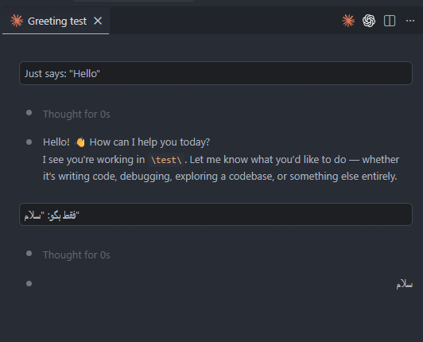

# Claude Code RTL Patch

[](https://opensource.org/licenses/MIT)
[]()
[]()

A cross-platform Node.js patch that injects `dir="auto"` into the Claude Code VSCode extension's webview, enabling proper Right-to-Left (RTL) and bidirectional text rendering for assistant messages.


[]()
---

## 🧠 The Problem

Anthropic's Claude Code VSCode extension renders assistant messages inside a webview without a `dir` attribute. For users writing in RTL languages (Arabic, Persian, Hebrew, Urdu, etc.), this causes:

- Assistant responses to render left-to-right regardless of content
- Mixed LTR/RTL text to misalign, break punctuation placement, and become unreadable
- No automatic direction detection — every message needs manual workarounds

This patch fixes that by injecting `dir="auto"` into the assistant message container, letting the browser determine text direction per-message based on its content.

---

## ✨ What It Does

- Locates **all installed versions** of the Claude Code extension across VSCode, VSCode Insiders, and VSCode OSS
- Patches `webview/index.js` by injecting `dir:"auto"` into the `data-testid="assistant-message"` React element
- Safe: detects already-patched files and skips them (no duplicate injection)
- Zero dependencies — uses only Node.js built-in modules (`fs`, `path`, `os`)

---

## 🚀 Quick Start

### Prerequisites

- [Node.js](https://nodejs.org/) v14 or later
- [Visual Studio Code](https://code.visualstudio.com/) with the [Claude Code extension](https://marketplace.visualstudio.com/items?itemName=anthropic.claude-code) installed

### One-Command Run

```bash
node patch-claude.js
```

That's it. Close and reopen VSCode completely for the change to take effect.

### Manual (if you prefer)

```bash
git clone https://github.com/YOUR_USERNAME/claude-code-rtl-patch.git
cd claude-code-rtl-patch
node patch-claude.js
```

---

## 🔧 How It Works

```
┌─────────────────────────────────────────────────┐
│  1. OS Detection                                 │
│     Windows → %USERPROFILE%\.vscode\extensions   │
│     macOS   → ~/.vscode/extensions               │
│     Linux   → ~/.vscode/extensions               │
├─────────────────────────────────────────────────┤
│  2. Glob Scan                                    │
│     Finds all anthropic.claude-code-* dirs       │
│     Also scans .vscode-oss & .vscode-insiders    │
├─────────────────────────────────────────────────┤
│  3. Regex Transform                              │
│     /"data-testid":"assistant-message"([^}]*)}/  │
│     → injects dir:"auto" right after testid      │
├─────────────────────────────────────────────────┤
│  4. Safety Checks                                │
│     ┣━ File exists?                              │
│     ┣━ Already patched? (skip)                    │
│     ┗━ Write permission?                          │
├─────────────────────────────────────────────────┤
│  5. Write & Report                               │
│     Saves patched index.js, prints summary       │
└─────────────────────────────────────────────────┘
```

### Regex Strategy

The script targets a stable anchor (`data-testid="assistant-message"`) rather than relying on minified variable names that change every build:

```
Before:  "data-testid":"assistant-message",className:
After:   "data-testid":"assistant-message",dir:"auto",className:
```

---

## ⚠️ Important Caveats

| | |
|---|---|
| 🔄 **Full Restart Required** | You **must fully quit and reopen VSCode** — a window reload (`Ctrl+Shift+P` → "Reload Window") is **not enough** because webview resources are cached at the Electron level. |
| 🗑️ **Volatile Patch** | This is a **local filesystem patch**. Every time the Claude Code extension auto-updates, your changes **will be wiped** and you'll need to re-run `node patch-claude.js`. |
| 🔒 **Unsupported** | This is a community workaround, not endorsed by or affiliated with Anthropic. Use at your own risk. |

---

## 📂 Project Structure

```
.
├── patch-claude.js     # Main patching script
├── README.md           # This file
└── LICENSE             # MIT License
```

---

## 🤝 Contributing

Found an edge case? A new extension version broke the regex? Open an issue or submit a PR.

Before submitting, please:
1. Test on your platform (Windows / macOS / Linux)
2. Verify no duplicate injection on re-run
3. Check against the latest Claude Code extension version

---

## 📄 License

MIT — see [LICENSE](LICENSE).

---

## 🔗 Related

- [Claude Code VSCode Extension](https://marketplace.visualstudio.com/items?itemName=anthropic.claude-code)
- [MDN: dir attribute](https://developer.mozilla.org/en-US/docs/Web/HTML/Global_attributes/dir)
- [W3C: RTL Scripts](https://www.w3.org/International/questions/qa-scripts)
